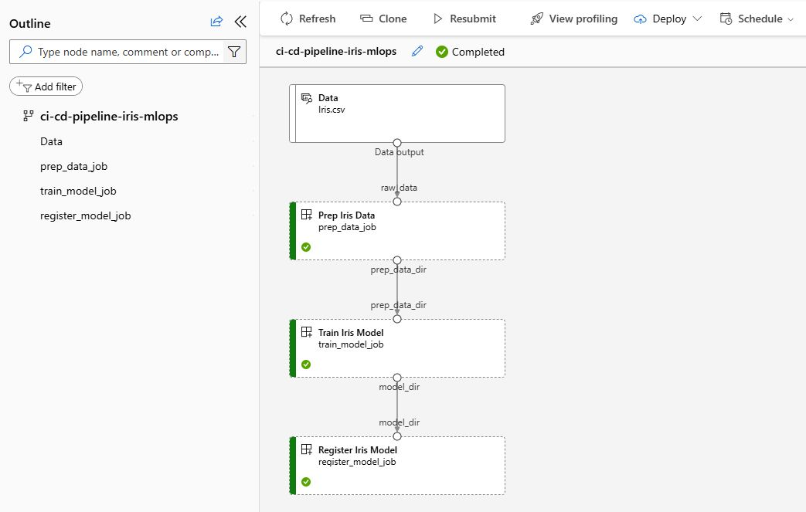

# AzureML-Pipeline

This project implements an MLOps CI/CD pipeline using Azure Machine Learning. It automates the lifecycle of an Iris classification model, from code changes to model registration.

## Workflow

The pipeline follows a "Infrastructure as Code" approach and executes the following steps automatically upon a `git push`:

1.  **Trigger:** GitHub Actions starts the workflow using the Azure ML CLI.
2.  **Job Execution:** The pipeline runs on an Azure ML CPU Cluster.
    * **Data Prep:** Processes the raw `Iris.csv` data.
    * **Train Model:** Trains the model using Scikit-learn.
    * **Register Model:** Versions and saves the `iris-classifier` to the Azure ML Model Registry.

## Project Structure

* `pipeline.yml`: Defines the main pipeline inputs, compute, and job sequence.
* `.github/workflows/train.yml`: The GitHub Actions CI/CD trigger file.
* `components/`: Reusable YAML definitions for pipeline steps (`prep_data`, `train_model`, `register_model`).
* `src/`: Python scripts containing the training logic.